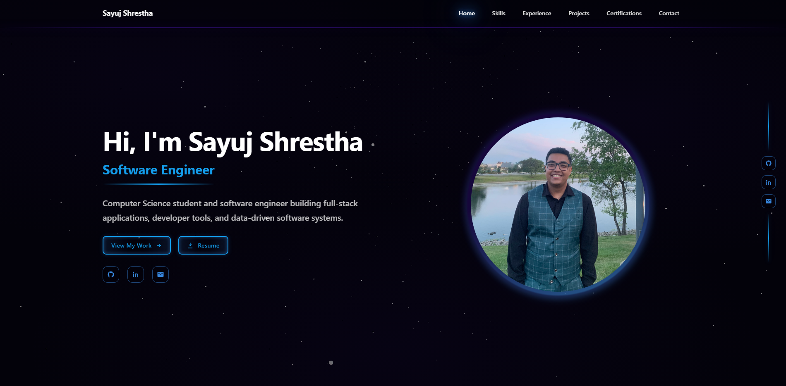

# My Portfolio

A responsive, single-page developer portfolio built with React and Vite.



Live Website: https://sayuj.dev/

## Overview

This project showcases:
- Technical skills
- Work experience
- Featured projects with detailed modals
- Certifications
- Contact information

It also includes:
- Animated WebGL particle background (OGL)
- Mobile-friendly navigation
- Resume support (download from Hero, view in browser from Footer)

## Tech Stack

- React
- Vite
- JavaScript (ES modules)
- CSS
- OGL (WebGL particles)

## Project Structure

```text
.
|-- .github/
|   `-- workflows/
|       `-- deploy.yml                  # GitHub Pages deployment workflow
|-- public/
|   |-- images/                         # Project images, logos, and certificate assets
|   `-- resume/
|       `-- resume.pdf                  # Resume file used by Hero/Footer resume links
|-- src/
|   |-- components/
|   |   |-- Footer.jsx                  # Footer links and social/contact icons
|   |   |-- SideSocial.jsx              # Side social rail
|   |   `-- SimpleNav.jsx               # Desktop/mobile navigation
|   |-- data/
|   |   `-- skills.js                   # Skills data source
|   |-- sections/
|   |   |-- HeroSection.jsx             # Landing hero section
|   |   |-- SkillsSection.jsx           # Skills section UI
|   |   |-- ExperienceSection.jsx       # Experience timeline/cards
|   |   |-- ProjectsSection.jsx         # Featured projects grid + modal
|   |   |-- CertificationsSection.jsx   # Certification cards
|   |   `-- ContactSection.jsx          # Contact form + links
|   |-- styles/
|   |   |-- base.css
|   |   |-- nav.css
|   |   |-- hero-shell.css
|   |   |-- hero-details.css
|   |   |-- footer.css
|   |   |-- scaling.css
|   |   |-- sections.css
|   |   `-- sections/
|   |       |-- shared.css
|   |       |-- skills.css
|   |       |-- experience.css
|   |       |-- projects.css
|   |       |-- certifications.css
|   |       `-- contact.css
|   |-- utils/
|   |   `-- paths.js                    # Path/base URL helpers for deployment environments
|   |-- App.jsx                         # Main page composition and section routing logic
|   |-- main.jsx                        # React app entry point
|   |-- Particles.jsx                   # OGL particle animation component
|   |-- Particles.css                   # Particle container styles
|   `-- styles.css                      # Global style imports
|-- index.html                          # Vite HTML entry
|-- package.json                        # Scripts and dependencies
`-- vite.config.js                      # Vite configuration
```

## Getting Started

### 1. Install dependencies

```bash
npm install
```

### 2. Run locally

```bash
npm run dev
```

### 3. Build for production

```bash
npm run build
```

### 4. Preview production build

```bash
npm run preview
```

## Resume Setup

Place your resume file here:

```text
public/resume/resume.pdf
```

## Deployment (GitHub Pages)

This repo uses GitHub Actions workflow:

```text
.github/workflows/deploy.yml
```

### Pages settings

1. Go to `Settings -> Pages`
2. Set **Source** to **GitHub Actions**
3. Push to `main` to trigger deployment

## Custom Domain

If you use a custom domain (example: `www.sayuj.dev`):

1. In `Settings -> Pages`, set **Custom domain**
2. Add DNS record:
   - Type: `CNAME`
   - Host: `www`
   - Value: `sayuj0.github.io`
3. Enable **Enforce HTTPS** after DNS propagation

## License

Personal portfolio project.

&copy; 2026 Sayuj Shrestha. All Rights Reserved.
